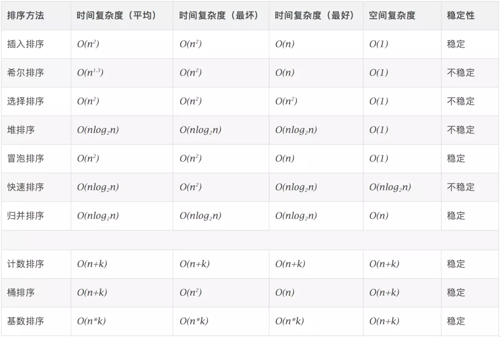

# javascript

## javascript 基础系列学习
[多种继承方式](./interview/prototype/extends.md)

## 手写源码系列

#### Promise

[手写Promise](./interview/function/promise.js)

>
  参考文献
  [Promise](https://github.com/then/promise)
  [asap](https://github.com/kriskowal/asap)
>

## ES6 基础系列学习

#### Set、Map、WeakSet 和 WeakMap的区别
[SetMap](./interview/ES6/SetMap.md)

#### Iterator 迭代器与 for of
[Iterator](https://github.com/liubin915249126/javascript/blob/master/interview/ES6/Iterator.md)
[参考文献](https://github.com/mqyqingfeng/Blog/issues/90)

## 算法学习系列

### 排序算法

#### 冒泡排序
>
  [冒泡排序](./interview/algorithm/bubble-sort.md)
  [参考文献](https://www.jianshu.com/p/eb191e4b2bc1)
>
#### 选择排序
[选择排序](./interview/algorithm/selection-sort.md)

## javascript,jquery相关
<!-- 说明 -->
### 说明
jquery插件皆可用于react,使用方法:[react中使用jquery插件](https://github.com/liubin915249126/react-study/tree/master/jquery%20in%20react)

<!--lencharts-->
### 封装了一个组织架构图的jquery插件[lenharts](https://github.com/liubin915249126/javascript/tree/master/lencharts)
#### 效果图 

<!--视差效果-->
#### 视差效果[parallax](https://github.com/liubin915249126/javascript/blob/master/Parallax/index.html)：

#### 用SVG连接两个div[index.html](https://github.com/liubin915249126/javascript/blob/master/SVG/index.html)d3.js动态修改SVG属性

<!--判断鼠标划入方向-->
#### js判断鼠标划入方向[mousedirction](https://github.com/liubin915249126/javascript/blob/master/mouseDirction.html)

<!-- jsplumb -->
### [jsplumb](https://github.com/liubin915249126/javascript/tree/master/jsplumb)流程图插件    
#### 效果图 

<!-- spacetree -->
### [spacetree](https://github.com/liubin915249126/javascript/tree/master/spacetree)定制内容,异步加载子节点
#### 效果图

#### 定制化内容后的效果图

#### jquery放大镜插件[index1.html](https://github.com/liubin915249126/javascript/blob/master/imagezoom/index1.html)

#### html+css+js 画出的架构图[index1.html](https://github.com/liubin915249126/javascript/blob/master/lencharts/examples/index1.html)
